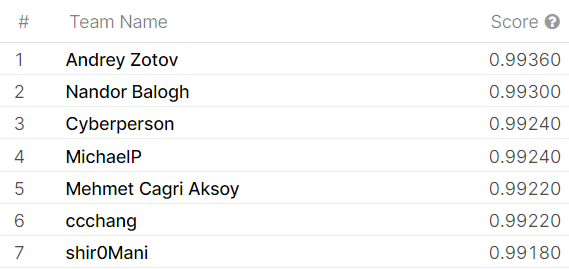
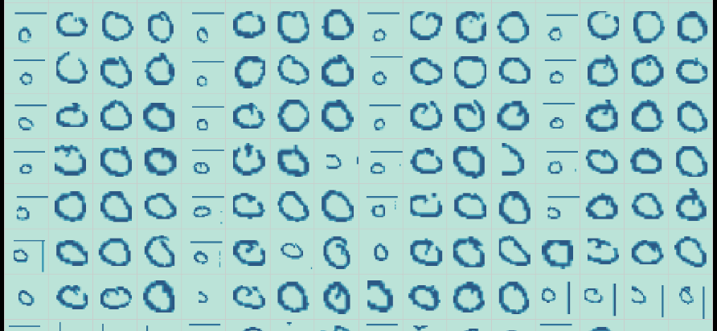
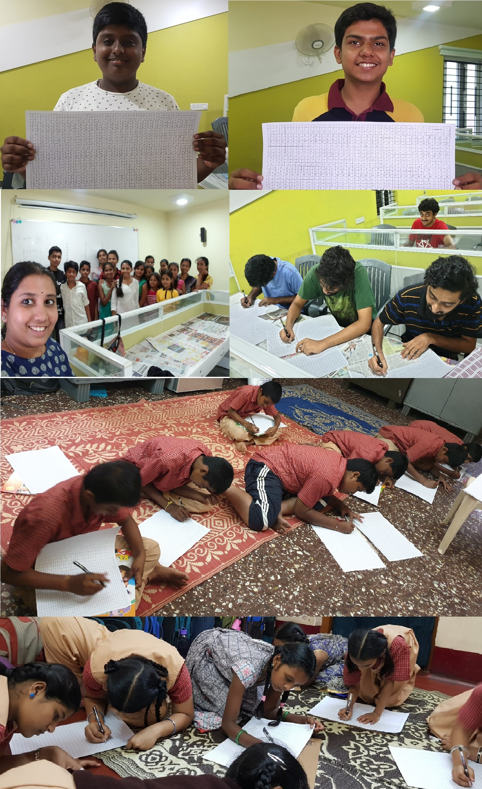
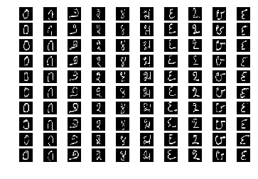
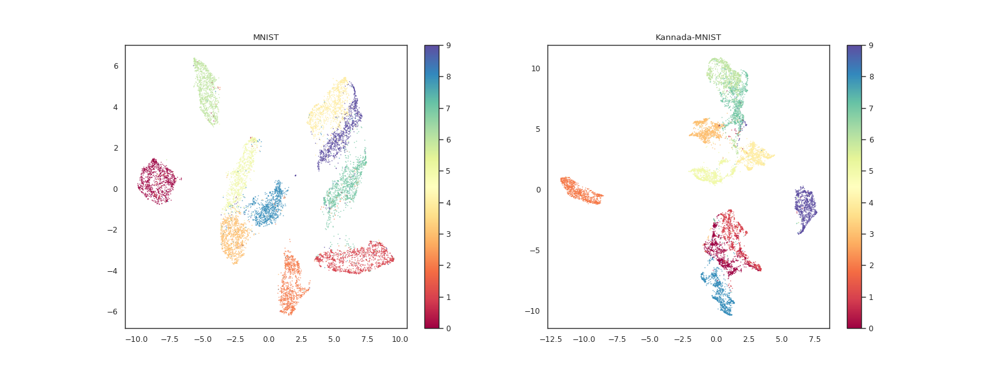
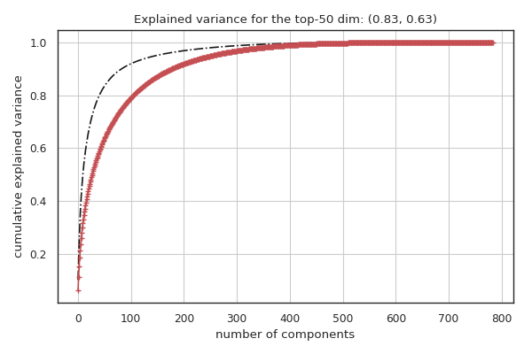
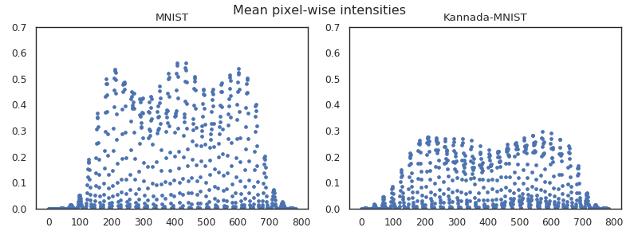

# Kannada_MNIST

## UPDATE!

This dataset was used in a [Kaggle Playground Code Competition](https://www.kaggle.com/c/Kannada-MNIST/overview)
that ended in December-2019.

It attracted entries from a staggering 1214 teams around the world and seen in the table below is the [final public leaderboard](https://www.kaggle.com/c/Kannada-MNIST/leaderboard)




The community also generated an incredible set of resources in the form of tutorials and [notebooks](https://www.kaggle.com/c/Kannada-MNIST/notebooks), of which, the ones I’d like to highlight are: 


- [Melissa Rajaram’s model-ensembling-and-transfer-learning](https://www.kaggle.com/melissarajaram/model-ensembling-and-transfer-learning)
- [Martin Gorner’s TF-data-augmentation](https://www.kaggle.com/martingorner/kannada-martin-keras-with-tf-data-augmentation)
- [Adrian Zinovei’s Tableau visualization](https://public.tableau.com/profile/adrian.zinovei#!/vizhome/KaggleKannadaMNIST/KannadaKaggle)



- [Igor Tokarev’s Keras tuner](https://www.kaggle.com/polyzer/hyperparameters-tuning-with-kerastuner-hyperresnet)

- [Parul Pandey’s t-SNE visualization](https://www.kaggle.com/parulpandey/visualizing-kannada-mnist-with-t-sne)

## Citing Kannada-MNIST
If you use Kannada-MNIST in a peer reviewed paper, we would appreciate referencing it as:

**Prabhu, Vinay Uday. "Kannada-MNIST: A new handwritten digits dataset for the Kannada language." arXiv preprint arXiv:1908.01242 (2019).**. 

Bibtex entry:
```latex
@article{prabhu2019kannada,
  title={Kannada-MNIST: A new handwritten digits dataset for the Kannada language},
  author={Prabhu, Vinay Uday},
  journal={arXiv preprint arXiv:1908.01242},
  year={2019}
}

```
I created this dataset with the help of many wonderful volunteers:



The Kannada-MNIST dataset was created an a drop-in substitute for the standard MNIST dataset. An example grid of images contributed by the volunteers look like:




[Link to the Kaggle repo](https://www.kaggle.com/higgstachyon/kannada-mnist "Kaggle dataset-link")

[Link to the Zenodo repo](https://zenodo.org/record/3359691#.XUYvLuhKiUm "Zenodo datasets link")


## Kannada-MNIST v/s MNIST comparisons
### 1: UMAP-plots


### 2: Explained variance by PCA dimensions



### 3: Pixel intensities




